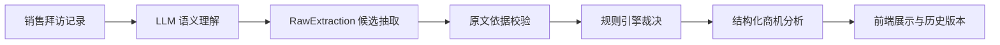

# 商机录入与分析 AI Agent

面向销售拜访后的商机信息整理场景，本项目将自然语言拜访记录转化为结构化商机分析，并结合原文依据校验与业务规则完成阶段、风险、字段状态和待确认信息判断。

它的目标是减少销售拜访后的重复整理，提高 CRM 商机信息的完整性、判断一致性与可追溯性。当前项目生成结构化商机分析、待确认事项和分析历史，不直接写入真实企业 CRM。

## 项目背景

销售拜访记录通常是自然语言纪要，里面会混合客户明确表达、销售主观判断、模糊推测、缺失信息和前后不一致的信息。如果直接把文本总结成 CRM 字段，容易出现三类问题：

- 关键信息不完整，例如预算、决策人、时间计划缺失。
- 事实与推断混杂，例如把“挺感兴趣”“可能推进”写成确定结论。
- 阶段判断不一致，例如把已同意 Demo、已讨论报价、已进入审批混在同一阶段。

本项目把这类销售记录处理为可查看依据、可继续补充、可重新分析的商机结果。

## 核心能力

- **结构化提取**：从销售拜访记录中提取客户需求、核心场景、预算、决策人、影响人、时间计划、商机阶段、风险、下一步行动和未确认信息。
- **规则化判断**：按照内置业务规则判断 S0-S5 商机阶段，并生成字段的已确认、未确认或冲突状态。
- **原文依据追溯**：关键字段和阶段判断保留原文依据，前端可查看对应说明。
- **未确认信息管理**：金额、姓名、权限、时间等信息缺失或证据不足时，明确标记为未确认，不自动补全。
- **冲突与风险识别**：对同一字段的矛盾表达同时保留，并进入风险或待确认事项。
- **补充事实后重新分析**：销售可补充预算、决策人、时间计划、下一步行动等新事实，系统生成新的分析版本。
- **历史记录保留**：同一商机的多次分析会保存为分析版本，便于查看阶段和字段变化。

## 目标 CRM 字段

Agent 根据销售拜访记录自动提取以下 10 类信息：

| 字段 | 处理方式 |
| --- | --- |
| 客户需求 | 提取客户明确表达的业务问题、需求或改进目标。 |
| 核心场景 | 提取明确的使用场景、业务流程或落地范围。 |
| 预算 | 保留客户原始预算表达；缺失、不可用或冲突时标记为未确认或冲突。 |
| 决策人 | 只有存在最终审批、拍板或购买决策权限依据时才确认。 |
| 影响人 | 记录能影响方案、技术评估或采购判断的参与人。 |
| 时间计划 | 记录明确的时间和对应事项；缺失时标记为未确认。 |
| 商机阶段 | 按 S0-S5 规则裁决，不由模型自由判断。 |
| 风险 | 标记预算不可用、需求失效、冲突、采购推进等风险。 |
| 下一步行动 | 只记录客户明确约定的动作、负责人和时间；缺失项标记为待确认。 |
| 未确认信息 | 汇总需要销售继续确认的关键问题。 |

## 商机阶段

| 阶段 | 名称 | 达成条件 |
| --- | --- | --- |
| S0 | 线索 | 只有初步接触，无明确需求。 |
| S1 | 需求初探 | 明确至少一个业务问题或使用场景。 |
| S2 | 方案验证 | 客户明确同意演示、试用、技术交流或方案评估。 |
| S3 | 商务评估 | 已讨论预算、报价、采购流程或合同条款之一，且需求仍有效。 |
| S4 | 决策审批 | 明确进入内部立项、审批或供应商决策。 |
| S5 | 赢单 / 签约 | 已签合同或正式订单已确认。 |

## 系统架构



核心分工如下：

- **LLM 语义理解**：理解自然语言销售记录，抽取候选事实、阶段信号、人物信息、预算、时间计划、下一步行动、模糊信息和冲突候选。
- **RawExtraction 候选抽取**：模型输出的是候选结构化信息，不直接决定最终 CRM 字段状态、最终商机阶段或最终风险。
- **原文依据校验**：校验引用是否真实来自输入文本，并判断引用是否足以支撑对应结论，过滤孤立关键词、单独姓名、过短片段等证据不足的内容。
- **规则引擎裁决**：根据业务规则生成最终字段状态、S0-S5 阶段、风险、待确认事项和下一步行动完整性判断。
- **结构化结果展示**：前端展示商机阶段、商机概览、CRM 字段、原文依据、风险、下一步行动、待确认事项和分析版本。

## 业务规则如何落地

系统把业务规则拆到 Prompt、原文依据校验和规则引擎三层中执行。

### Prompt：定义语义边界

Prompt 要求模型只抽取候选事实和阶段信号，并遵守以下边界：

- 客户需求与核心场景分开：需求是业务问题或改进目标，场景是使用流程或落地范围。
- 人物出现不等于决策人：参会人、联系人、技术评估人不会自动成为最终采购决策人。
- 预算保留原始表达：不把预算范围、模糊金额或不可用预算改写成确定金额。
- 时间计划需要对应事项：只记录有明确时间和推进事项的表达。
- 下一步行动来自客户明确约定：动作、负责人、时间分别判断，缺失时保留待确认。
- 阶段信号只是候选：最终 S0-S5 由规则引擎根据阶段定义裁决。

### 原文依据：约束关键结论

预算、决策人、时间计划、商机阶段等关键判断需要保留原文依据。系统不仅检查引用是否出现在输入中，还会判断该引用是否足以支撑结论。

例如，仅有“王总参加会议”可以证明王总参会和角色出现，但不能证明王总拥有最终采购决策权。没有审批、拍板、采购决策等依据时，决策人保持未确认。

### 规则逻辑：形成确定产品行为

规则引擎基于候选事实和有效依据生成最终结果：

- 阶段信号映射到 S0-S5，并按更高阶段条件优先裁决。
- 缺失、模糊或证据不足的信息进入未确认。
- 同一字段出现矛盾信息时保留冲突值，并进入风险或待确认。
- 预算不可用、需求失效、采购受阻等表达进入风险判断。
- 下一步行动分别检查动作、负责人和时间，缺失项标记为待确认。

## 使用流程

1. 在前端输入一段销售拜访记录。
2. Agent 生成结构化商机分析，包括阶段、字段状态、风险、下一步行动和待确认事项。
3. 点击字段或阶段说明，查看对应原文依据。
4. 对待确认事项补充事实，例如预算、决策人、时间计划或下一步行动。
5. 系统基于原始记录和补充事实重新分析，并生成新的分析版本。
6. 在分析历史中查看、筛选、搜索或删除历史商机记录。

## 典型示例

输入示例：

```text
今天拜访了星河科技客户服务部，参会人包括客服负责人王总和 IT 王工。
客户说客服工单处理慢，售后知识库查询也比较耗时，希望用智能问答先覆盖售后知识库场景，
并减少客服人工分单。王总说下周四可以安排一次产品 Demo，让 IT 王工一起看效果。
预算金额暂时还没有确认，最终采购决策人也没有明确。
```

可能输出：

- 客户需求：客服工单处理慢，售后知识库查询耗时。
- 核心场景：售后知识库智能问答、减少客服人工分单。
- 商机阶段：S2 方案验证，因为客户明确同意安排产品 Demo。
- 预算：未确认。
- 决策人：未确认。
- 影响人：IT 王工参与看效果。
- 下一步行动：安排产品 Demo；负责人待确认；时间为下周四。
- 未确认信息：预算金额、最终采购决策人、下一步行动负责人。

补充事实后：

```text
客户会后确认今年智能客服项目预算约 60 万。
最终采购决策人是客服负责人王总。
客户已确认下一步行动是安排产品 Demo，负责人为销售顾问林敏，时间为下周四下午。
```

系统会重新分析并生成新版本，预算、决策人和下一步行动状态会更新；如果补充事实触发更高阶段条件，商机阶段也会同步更新。

## API 能力

| 方法 | 路径 | 说明 |
| --- | --- | --- |
| GET | `/health` | 查看后端健康状态和 provider 配置状态。 |
| GET | `/examples` | 获取内置示例输入。 |
| POST | `/analyze` | 创建一次商机分析，并生成第一版结果。 |
| POST | `/clarify` | 提交补充事实，触发同一商机的重新分析。 |
| GET | `/analyses` | 获取历史分析列表，支持筛选和搜索。 |
| GET | `/analyses/{analysis_id}` | 获取当前商机分析详情。 |
| GET | `/analyses/{analysis_id}/revisions/{revision}` | 获取指定分析版本。 |
| DELETE | `/analyses/{analysis_id}` | 删除单条历史分析。 |
| POST | `/analyses/bulk-delete` | 批量删除历史分析。 |
| DELETE | `/analyses` | 清空历史分析。 |

## 测试与可靠性

后端测试覆盖以下关键业务边界：

- 阶段边界：验证 S0-S5 的达成条件和优先级。
- 事实边界：验证缺失、模糊、推测表达不会被补成确定事实。
- 冲突边界：验证同一字段的矛盾信息会被同时保留并进入风险或待确认。
- 原文依据边界：验证关键结论不仅有引用，而且引用需要足以支撑字段结论。
- 重新分析边界：验证补充事实后，字段、阶段、风险、待确认事项和分析版本会同步更新。
- API 与历史记录：验证创建分析、读取版本、列表筛选、批量删除等行为。
- Prompt 契约：验证 Prompt 明确约束候选抽取、阶段信号和下一步行动边界。

当前测试结果：

```text
203 passed, 1 warning
```

前端也提供 lint 和 TypeScript 类型检查命令，用于保证界面代码的一致性。

## 技术栈

- **后端**：Python 3.11+、FastAPI、Pydantic v2、httpx、uvicorn。
- **LLM Provider**：本地默认 `mock` provider；可通过环境变量切换到 DeepSeek provider。
- **数据存储**：SQLite，保存分析会话、分析版本、原始抽取结果和最终结构化结果。
- **前端**：Next.js 16、React 19、TypeScript、Tailwind CSS、Radix UI、lucide-react。
- **测试**：pytest、ESLint、TypeScript typecheck。

## 项目结构

```text
backend/
  app/
    main.py          # FastAPI 入口与 API 路由
    pipeline.py      # 分析流水线
    prompts.py       # LLM 抽取与概览 Prompt
    providers.py     # Mock / DeepSeek provider
    evidence.py      # 原文依据定位与校验
    rules.py         # 商机阶段、字段状态、风险与待确认规则
    repository.py    # SQLite 历史记录存储
    schemas.py       # RawExtraction 与 ValidatedOpportunity 数据结构
    summary.py       # 基于已验证结果生成商机概览
  tests/             # 业务边界、API、回归与 Prompt 契约测试

frontend/
  app/               # Next.js 页面
  components/        # 输入页、结果页、历史页组件
  lib/               # API client、类型与前端工具函数

scripts/             # 本地启动脚本
docs/                # 当前项目文档与验证记录
```

## 本地运行

### 环境要求

- Python 3.11+
- Node.js 与 npm

### 后端

```bash
python3 -m venv .venv
.venv/bin/python -m pip install -e ".[dev]"
cp .env.example .env
.venv/bin/uvicorn backend.app.main:app --host 127.0.0.1 --port 8000 --reload
```

默认配置使用 `mock` provider，不需要外部 API Key。

### 前端

```bash
cd frontend
npm install
cp .env.example .env.local
npm run dev
```

打开：

- 前端页面：`http://127.0.0.1:3000`
- 后端接口文档：`http://127.0.0.1:8000/docs`

### 使用 DeepSeek provider

在 `.env` 中配置：

```bash
LLM_PROVIDER=deepseek
LLM_MODEL=<模型名称>
LLM_API_KEY=<API Key>
```

其余配置可参考 `.env.example`。

## 常用检查

```bash
.venv/bin/python -m pytest backend/tests -q
```

```bash
cd frontend
npm run lint
npm run typecheck
```

## 项目边界

- 当前项目聚焦销售拜访记录到结构化商机分析的闭环。
- 当前项目保存本地分析历史和分析版本，不直接写入真实企业 CRM。
- 下一步行动只记录客户明确约定的动作、负责人和时间；缺失项标记为待确认。
- 商机阶段、字段状态、风险和待确认事项由业务规则统一裁决。
- 商机概览基于已验证的结构化结果生成，并带有确定性回退。
